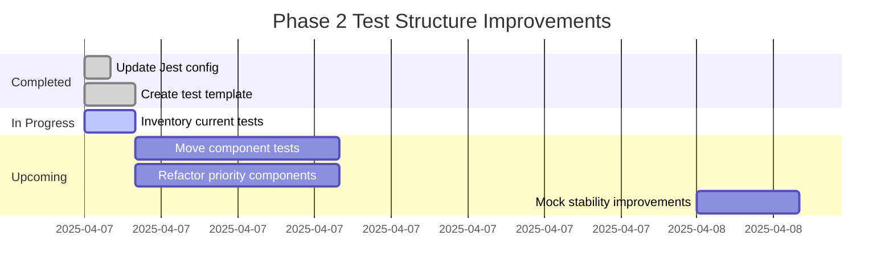
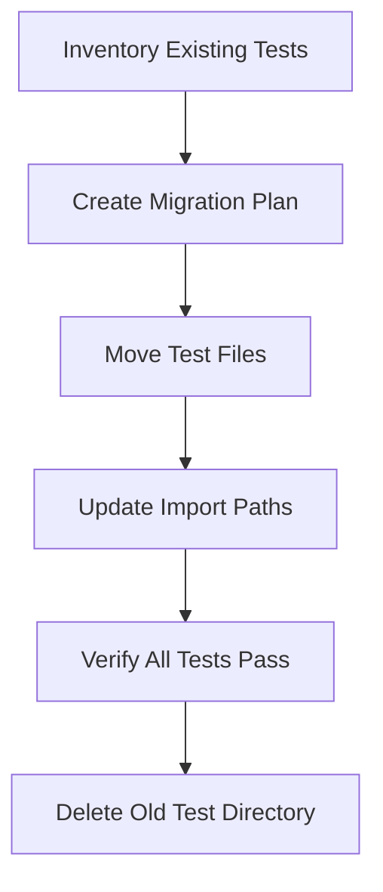
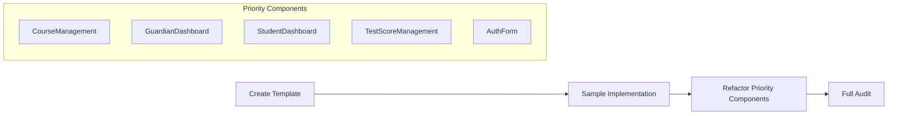
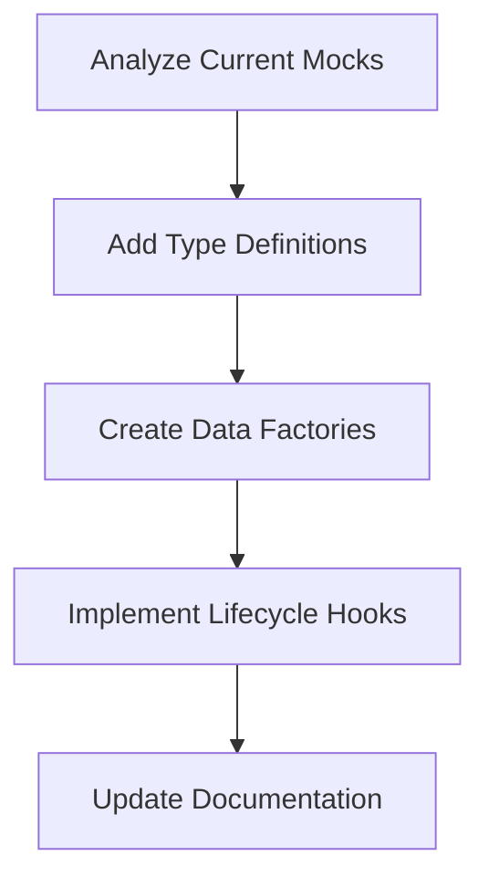

# Phase 2 Test Structure Improvement Plan

## Implementation Status



## Completed Work

### Jest Configuration Update
- Modified `jest.config.cjs` to support co-located test files
- Preserved existing test patterns while adding new ones
```javascript
testMatch: [
  '**/*.test.{ts,tsx}',
  '**/__tests__/**/*.{ts,tsx}',
  '**/?(*.)+(spec|test).{ts,tsx}'
]
```

### Standardized Test Template
Created `src/components/__template__.test.tsx` with:
- TypeScript types and React component example
- Clear sections for different test types
- Resolved all linting and type checking issues
- Example implementation with assertions

```typescript
// components/__template__.test.tsx
import { render } from '@testing-library/react'
import userEvent from '@testing-library/user-event'
import React from 'react'

type TestComponentProps = {
  isLoading?: boolean
  error?: string
  onAction?: () => void
}

const TestComponent: React.FC<TestComponentProps> = (props) => (
  <div data-testid="test-component">
    {props.isLoading && <span>Loading...</span>}
    {props.error && <span>{props.error}</span>}
    <button onClick={props.onAction}>Action</button>
  </div>
)

describe('Component Tests', () => {
  test('renders base state correctly', () => {
    const { getByTestId } = render(<TestComponent />)
    expect(getByTestId('test-component')).toBeInTheDocument()
  })
})
```


- **Key Files**: 
  - Update `jest.config.cjs` testMatch pattern
  - Modify `tsconfig.json` paths
  - Migrate tests from `src/__tests__` to component directories

### 2. Test Standardization


**Template Features**:
- Standardized describe blocks
- Consistent test organization
- Shared setup/cleanup patterns
- Unified assertion styles

### 3. Mock Stability Improvements


**Focus Areas**:
- Supabase client mocks
- PDF generation utilities
- Navigation/routing mocks
- Error handling utilities

### 4. Maintenance Tasks
- Resolve BUG-003 (CourseManagement test timeouts)
- Update Husky bypass scripts
- Ensure CI/CD pipeline compatibility

## Next Steps

1. **Test Migration**:
   - Inventory existing tests in `src/__tests__`
   - Create migration plan for each component
   - Update import paths and verify tests

2. **Priority Components**:
   - CourseManagement
   - GuardianDashboard
   - StudentDashboard
   - TestScoreManagement
   - AuthForm

3. **Mock Improvements**:
   - Type existing mocks
   - Create factory functions
   - Implement reset procedures

## Updated Energy/Focus Units

| Task                      | Status    | Units Remaining |
|---------------------------|-----------|-----------------|
| Test Co-location          | In Progress | 3 units        |
| Test Standardization      | Started   | 2 units        |
| Mock Improvements         | Pending   | 2 units        |

## Required File Changes

### jest.config.cjs Update
```diff
module.exports = {
  testMatch: [
-   '**/__tests__/**/*.test.tsx',
+   '**/*.test.tsx'
  ]
}
```

### New Test Template
````typescript
// components/__template__.test.tsx
describe('<ComponentName>', () => {
  // Shared setup
  const mockData = {}
  
  beforeAll(() => {
    // Global mock setup
  })
  
  beforeEach(() => {
    // Test-specific setup
  })
  
  // Test Sections
  describe('Rendering', () => {
    test('base state', () => {})
    test('loading state', () => {})
    test('error state', () => {})
  })
  
  describe('Interactions', () => {
    test('core functionality', () => {})
    test('edge cases', () => {})
  })
  
  afterEach(() => {
    // Cleanup
  })
})